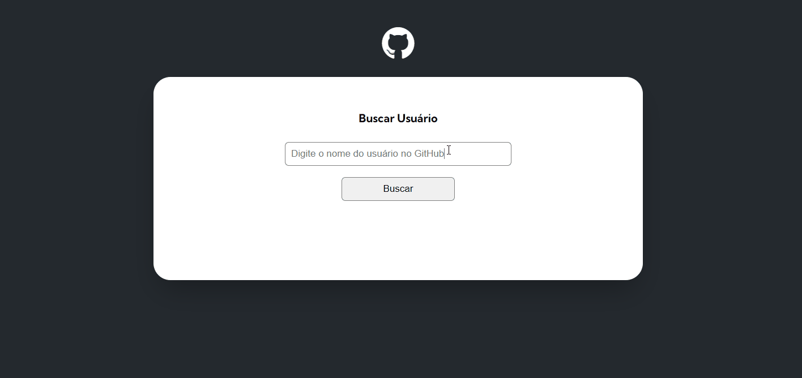

<h1>Projeto fetch Github API</h1>

Projeto criado pelos professores Beto e Cadu do curso DevQuest.

<h2>Visão geral</h2>

<h2>Como utilizar</h2>

<ol>
    <li>Acesse o link hospedado no github pages: https://john-dalton-27.github.io/projeto-fetch-github-api/</li>
    <li>Digite o profile-name do perfil do Github no campo e clique no botão Buscar ou pressione a tecla Enter.</li>
    <li>Clique sobre o repositório na lista para visitá-lo.</li>
</ol>

<h2>Tecnologias utilizadas</h2>

<ul>
    <li>HTML</li>
    <li>CSS</li>
    <li>Javascript</li>
    <li><a href="https://docs.github.com/en/rest/guides/getting-started-with-the-rest-api?apiVersion=2022-11-28" target="_blank">Github API</a></li>
</ul>

<h2>O que aprendi com o Projeto</h2>

Foi ensinado como trabalhar com requisições de API com fetch, utilizando métodos de Async e Await e o método Then. Boas práticas para refatorar o código, dividindo as 
funções em diferentes arquivos, para facilitar a manutenção e o entendimento do código. 
Resoluções de problemas, identificando o erro no console e corrigindo.

